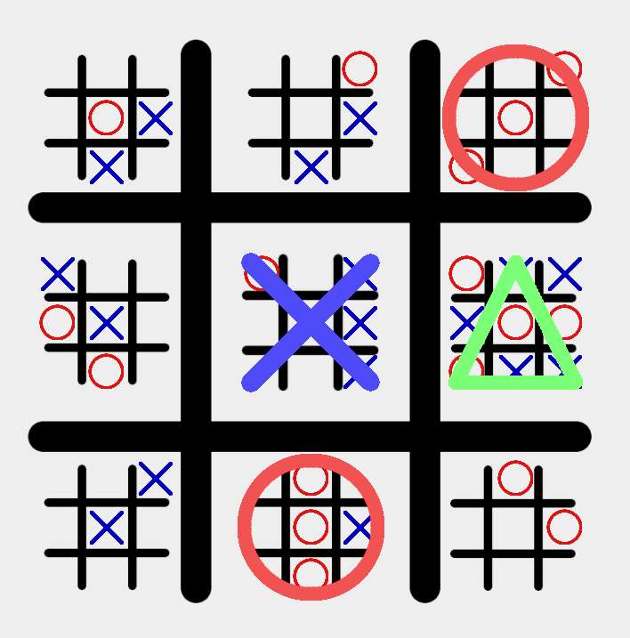

# Ultimate Tic-Tac-Toe ⭕❌

A multiplayer implementation of **Ultimate Tic-Tac-Toe** built with Python and Pygame, compiled for the web using Pygbag, and hosted on Fly.io.




## 🎮 What is Ultimate Tic-Tac-Toe?

Ultimate Tic-Tac-Toe is a strategy board game composed of nine Tic-Tac-Toe boards arranged in a 3x3 grid. It adds a "recursive" twist to the classic game:

1.  **Objective**: Win three mini-boards in a row (horizontally, vertically, or diagonally) to win the large board and the game.
2.  **Move Restriction**: Your move determines which mini-board your opponent must play in.
    - If you play in the top-right cell of a mini-board, your opponent **must** play in the top-right mini-board of the large grid.
3.  **Open Moves**: If a player is sent to a mini-board that has already been won or drawn, they can play **anywhere** on the board.
4.  **Have fun**.

## ✨ Features

-   **Multiplayer**: Play against friends online via WebSockets.
-   **Spectator Mode**: Watch games in progress.
-   **Cross-Platform**: Runs in the browser (via WASM) or as a native Python application.
-   **Clean UI**: Simple graphics and intuitive highlight system for valid moves.

## 🛠️ Tech Stack

-   **Frontend**: [Pygame](https://www.pygame.org/)
-   **Web Port**: [Pygbag](https://pygbag.github.io/)
-   **Backend**: [websockets](https://websockets.readthedocs.io/)
-   **Environment**: [uv](https://github.com/astral-sh/uv)
-   **Deployment**: [Fly.io](https://fly.io/)

## 🚀 Getting Started

### Prerequisites

-   Python 3.10+
-   [uv](https://github.com/astral-sh/uv) installed (`curl -LsSf https://astral-sh.uv.install.sh | sh`)

### Local Installation

1.  Clone the repository:
    ```bash
    git clone https://github.com/raphaelantoniocampos/ultimate-tic-tac-toe.git
    cd ultimate-tic-tac-toe
    ```

2.  Sync dependencies:
    ```bash
    uv sync
    ```

### Running Locally

-   **Local Mode (Development)**:
    1.  Start the server:
        ```bash
        uv run server/server.py
        ```
    2.  Start the client:
        ```bash
        cd client/
        uv run main.py
        ```

## 🚢 Deployment

The project is configured for deployment to **Fly.io**.

1.  **Build & Deploy**:
    ```bash
    fly deploy
    ```
    This uses the a `Dockerfile` to build the Pygbag web client and start both the HTTP server (serving the WASM files) and the WebSocket server.

## 📂 Project Structure

```text
.
├── client/             # Pygame client source code
│   ├── assets/         # Game images and fonts
│   ├── logic.py        # Shared game rules logic
│   └── main.py         # Client entry point
├── server/             # WebSocket server source code
│   └── server.py       # Handles game sessions and routing
├── Dockerfile          # Container configuration
└── fly.toml            # Fly.io deployment config
```

## ⭐ AI Usage

Artificial Intelligence Tools: Gemini 3.0 Pro and Flash in planning mode; 
Architectural Transition: AI was used to consult on the transition from standard TCP sockets to WebSockets to ensure browser compatibility via the Emscripten toolchain;
Environment Configuration: AI was used to resolve platform-specific import issues for WASM/Pygbag (Emscripten), specifically regarding the adjustment of sys.path and the js module bridge;
Networking Logic: AI suggested the logic for protocol switching (switching from ws to wss) by accessing the browser's window.location parameters to prevent security blocks in HTTPS environments;
Writing—Review & Editing: AI was used to refine the documentation and ensure the technical explanations of the network bridge were clear and concise;

## 📜 License

[MIT License](LICENSE)
